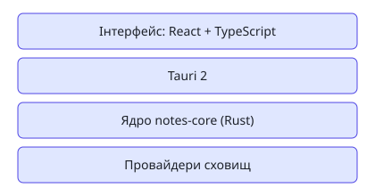

# MD Notes

Кросплатформний застосунок для бази знань у Markdown. Принципи —
[[Local-first]] і відкриті файли.



## Задачі

```query
type: task
where: project = [[MD Notes]]
sort: due asc
view: table
columns: [title, status, due, priority]
```

Поки запити не реалізовані (v0.3), ось список вручну:

- [x] [[Дерево файлів]]
- [ ] [[Граф знань]]
- [ ] [[Мобільна версія]]

## Люди

- [[Олена Коваль]] — дизайн інтерфейсу

#mdnotes
